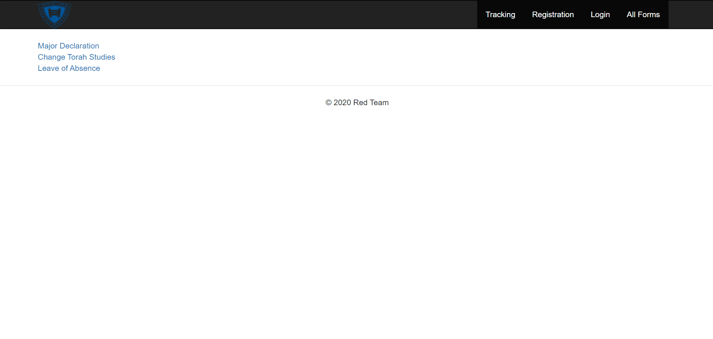
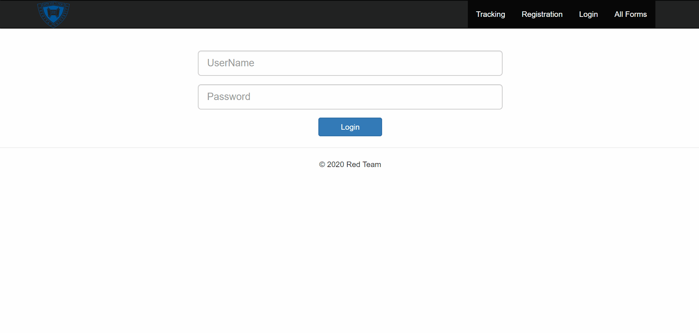
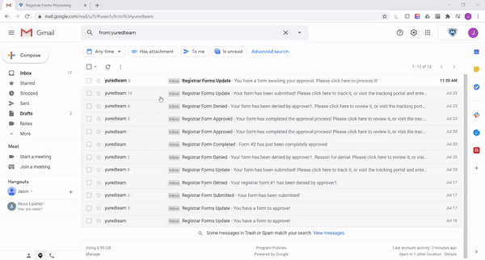
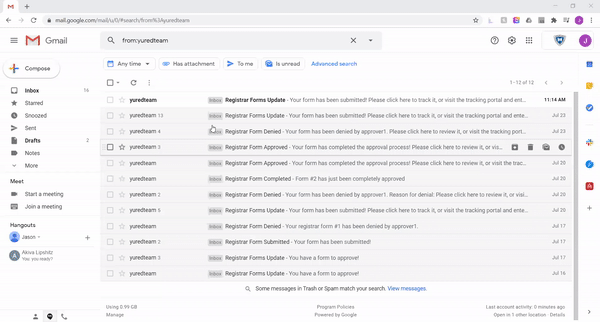
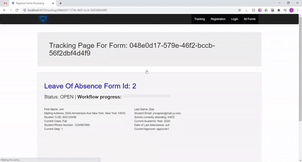
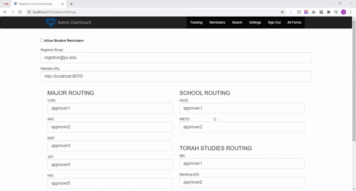
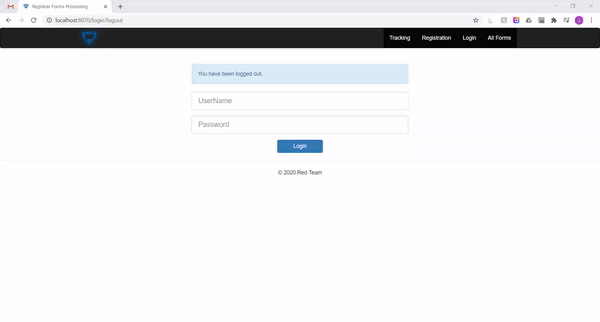

# Spring Boot Form Submission and Approval Workflow Web App
CREDIT to Dusan Reljic, who's [Spring Boot Shopping Cart Application](https://github.com/reljicd/spring-boot-shopping-cart) served as a helpful template and reference for our architecture


## About
This java-based web app was built for Yeshiva University's registrar office to allow for form
submission and tracking for students as well as multilevel, dynamic approval workflows for
deans and administrators.

Check out the video demo [here](https://youtu.be/tqkL_si9uBk)


## Functionality

### Core Functionality
Students have the ability to fill out and submit a form.



On submission, the student receives
an email confirmation that their form has been received.

The user (dean/administrator/office) who is first in the submitted form's
unique workflow will receive an email notifying them that they have a form
to approve.

The user can login and view their personal dashboard which lists
all forms that require their approval and choose to approve, deny, and/or comment
on each form.



Each approval triggers the next step in the workflow, sending an email to the subsequent approver.



If the workflow has been completed, the student will receive an email notifying them whether their form has been approved or denied.

### Additional Features
1. **Form Tracking Page**
- In their submission confirmation email, student receive a tracking number for their form which they can use to track the status of their form in the workflow, comment on it, and withdraw the form.




2. **Admin Interface**
- If a user is signed in with an account that has an admin role, they will be able to configure some global settings, like routing tables and student permissions.



- They will also be able to see all forms in the system, sorted by form type, and filtered by status.



3. **Query Page**

- An administrator account can search across all documents, both those that have finished their workflow as well as those still in the process, based on various fields such as name, email, and id number.


## Technologies Used
- **Spring Boot**
- **Spring Security** for user authentication
- **Thymeleaf** for dynamic front-end
- **JavaMailSender** for confirmation and reminder emails
- **Spring Data JPA**
- **H2** in-memory database

## How to run

#### Using Executable Jar

To create an executable jar run:

```bash
$ mvn clean package
```

To run that application, use the java -jar command, as follows:

```bash
$ java -jar target/registrar-workflow-0.0.1-SNAPSHOT.jar
```

Once the app starts, go to the web browser and visit http://localhost:8070/login

Admin username: **admin**

Admin password: **admin**

User username: **approver1**

User password: **password**

You can view the rest of the pre-populated usernames in the H2 Console

You can also register new users in the **Registration** tab

To exit the application, press **ctrl-c**.

## Helper Tools

### HAL REST Browser

Go to the web browser and visit `http://localhost:8070/`

You will need to be authenticated to be able to see this page.

### H2 Database web interface

Go to the web browser and visit `http://localhost:8070/h2-console`

In field **JDBC URL** put
```
jdbc:h2:mem:form_db
